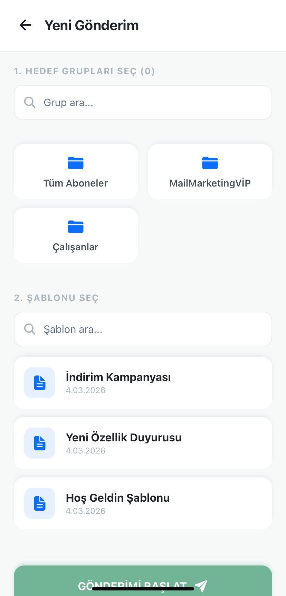
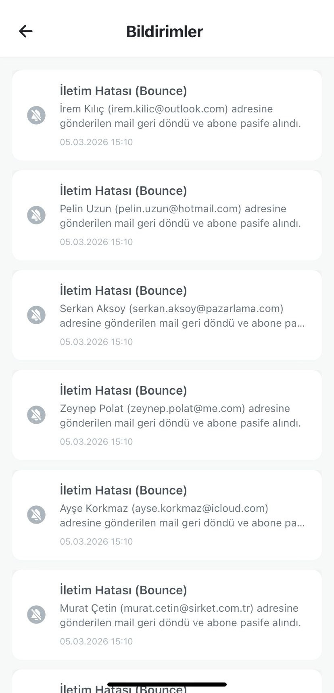
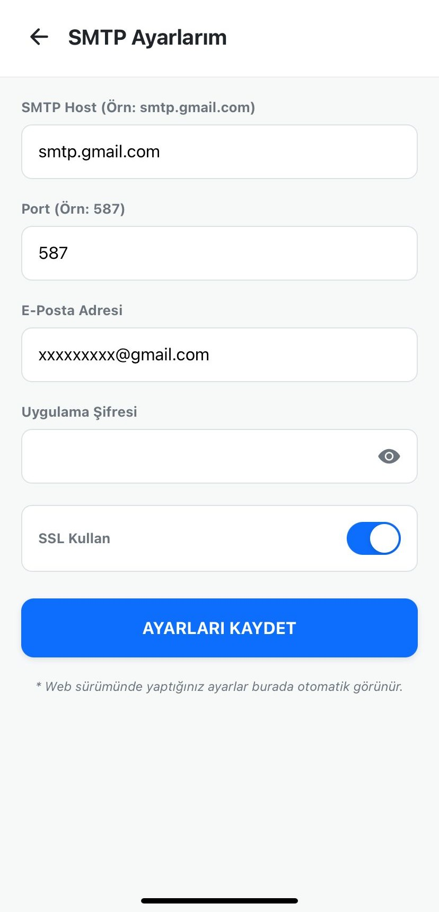
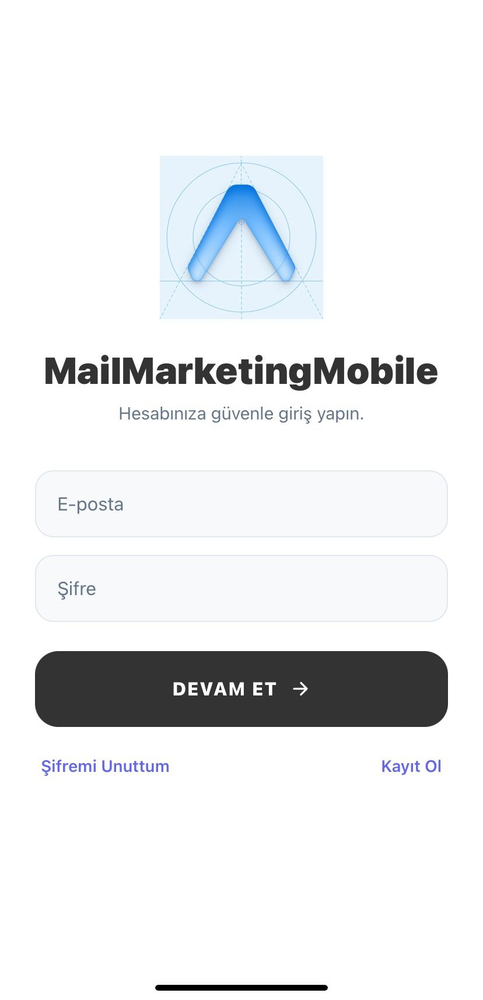
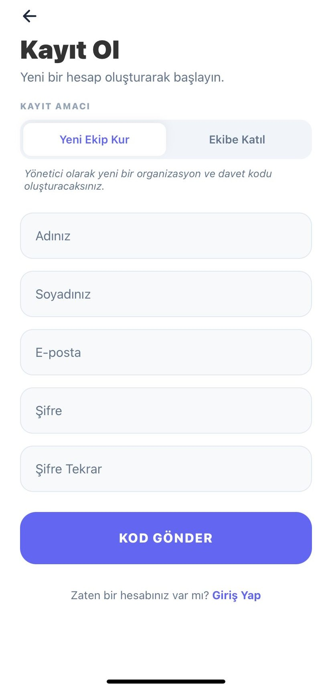
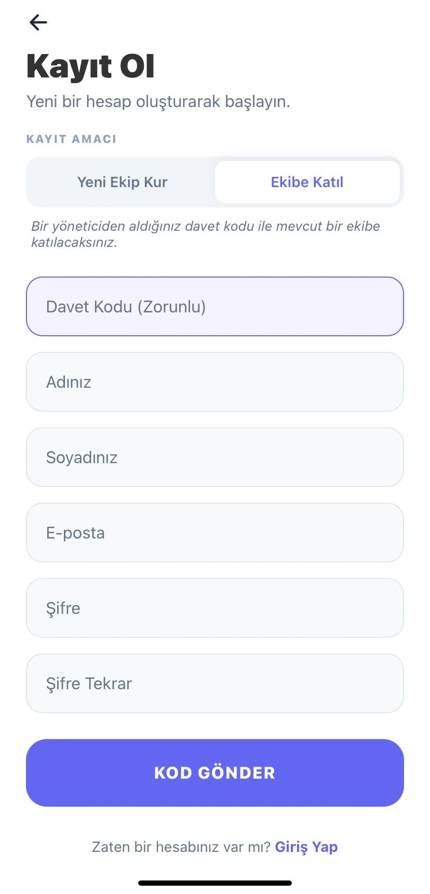
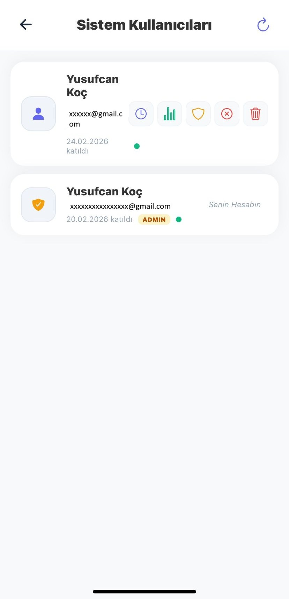

# 📱 Mail Marketing — React Native Mobile App

<p>
  
  
  
  
  
  
</p>

Bu dizin, **Email Marketing Suite** platformunun mobil yönetim uygulamasını içerir. React Native ve Expo üzerine inşa edilmiş bu uygulama; abone yönetimi, e-posta kampanyaları, gönderim raporları ve ekip yönetimini — bir bilgisayara ihtiyaç duymadan — cep telefonundan yapmanızı sağlar.

---

### 📸 Uygulama Ekran Görüntüleri & Videolar

| Anasayfa & Navigasyon | Menü Navigasyon | Mobil Abone Yönetimi |
| :---: | :---: | :---: |
|  |  |  |

| Yeni Gönderim | Şablonlarım | Raporlar & Analiz |
| :---: | :---: | :---: |
|  |  |  |

| Aktivite Günlüğü | Sistem Bildirimleri | Sistem Tanımları |
| :---: | :---: | :---: |
|  |  |  |

| Giriş Ekranı | Kayıt Ol (Admin) | Kayıt Ol (Kullanıcı) |
| :---: | :---: | :---: |
|  |  |  |

| Şifremi Unuttum | Kullanıcı Yönetimi | Profil Bilgilerim |
| :---: | :---: | :---: |
|  |  |  |

---

## ✨ Uygulama Ekranları & Özellikler

### 🏠 Dashboard (Anasayfa)
- Anlık toplam abone, aktif/pasif sayısı ve son kampanya özeti
- Haftalık gönderim istatistikleri (başarılı / başarısız)
- Bildirim merkezi

### 👥 Abone Yönetimi (`/subscribers`)
- Arama + Aktif/Pasif filtresi ile anlık liste filtreleme
- **Swipe-to-Delete / Swipe-to-Toggle** — Kaydırarak hızlı silme veya aktif/pasif geçiş
- **Long Press → Çoklu Seçim** — Basılı tutarak birden fazla abone seç, toplu işlem uygula
- Excel `.xlsx` dosyasından toplu abone içe aktarma
- E-posta format doğrulaması (hem istemci hem sunucu tarafında)

### 📂 Klasörler / Gruplar (`/subscribers/groups`)
- Özel klasörler oluşturarak aboneleri kategorize et
- Klasörden abone ekle/çıkar
- Sistem klasörleri (korumalı) ve özel klasörler ayrımı

### 🎨 Şablonlar (`/templates`)
- HTML içerikli e-posta şablonu oluştur ve kaydet
- Şablonları kampanyalarda kullan

### 🚀 Yeni Gönderim (`/campaign/new`)
- Şablon seçimi, hedef kitle belirleme (tüm aboneler veya belirli klasör)
- İnternet bağlantısı yoksa kampanya gönderimi engellenir (offline guard)
- Gerçek zamanlı bağlantı durumu göstergesi

### 📊 Raporlar (`/reports`)
- Gönderim geçmişi: Konu, alıcı, tarih, başarı/hata durumu
- Tarihe, duruma ve içeriğe göre gelişmiş filtreleme
- Toplu rapor silme

### 👤 Profil & Ayarlar (`/profile`, `/settings/smtp`)
- Kişisel bilgi güncelleme
- SMTP sunucu yapılandırması
- Güvenli çıkış (logout API çağrısı ile aktivite logu oluşur)

### 🛡️ Kullanıcılar (`/users`) — Yalnızca Admin
- Alt kullanıcı ekleme, rol değiştirme
- Davet kodu oluşturma
- **Yalnızca admin rolündeki hesaplarda görünür**

---

## 🏗️ Teknik Mimari & Tasarım Kararları

### Klasör Yapısı (Expo Router)
```
app/
├── (tabs)/
│   ├── index.tsx          # Dashboard
│   └── explore.tsx        # Menü ekranı
├── subscribers/
│   ├── index.tsx          # Abone listesi
│   ├── edit/[id].tsx      # Abone düzenleme
│   └── groups/            # Klasör yönetimi
├── campaign/
├── reports/
├── profile/
├── settings/
├── users/
├── login.tsx
└── register.tsx
```

### Kimlik Doğrulama Akışı
```
1. Kullanıcı login → API JWT token döner
2. Token + kullanıcı verisi → Expo SecureStore'a şifrelenmiş yazılır
3. Her API çağrısında Authorization: Bearer {token}
4. Logout → API'ye bildirim → SecureStore temizlenir → /login yönlendirmesi
```

### API İletişimi
`constants/Config.ts` içindeki `API_URL` sabitine göre tüm Axios çağrıları merkezi olarak yapılandırılmıştır. Her istek JWT header'ını otomatik ekler.

---

## 🎯 Mühendislik Öne Çıkanları

### 1. Native Swipeable (Kaydırarak İşlem)
`react-native-gesture-handler` Swipeable bileşeni ile her abone kartına sağa/sola kaydırma ile sil/durum-değiştir gestures eklendi. Klasik buton yerine %100 native mobil deneyim sağlar.

### 2. Çoklu Seçim Kipi (Long Press)
Herhangi bir karta uzun basıldığında seçim kipi aktif olur. Header, aksiyonlar ve seçim rozeti otomatik geçiş yapar. `BackHandler` ile Android geri tuşu seçimi iptal eder.

### 3. FlatList Sanallaştırması
10.000+ satırlık abone veya rapor listeleri, `FlatList` ile sanal render edilir. `initialNumToRender`, `maxToRenderPerBatch`, `windowSize` ve `removeClippedSubviews` ile Android/iOS RAM tüketimi minimize edilmiştir.

```tsx
<FlatList
  data={filteredSubscribers}
  keyExtractor={(item) => item.id.toString()}
  renderItem={renderItem}
  initialNumToRender={10}
  maxToRenderPerBatch={10}
  windowSize={5}
  removeClippedSubviews={Platform.OS === 'android'}
/>
```

### 4. Özel Alert Sistemi (CustomAlert)
Tüm platform genelinde React Native'in sistem `Alert.alert()` yerine özel `CustomAlert` bileşeni ve `AlertContext` kullanılır. Böylece:
- Tutarlı marka görünümü (renk, ikon, animasyon)
- Onay diyalogları (`type: 'confirm'`) için özelleştirilmiş butonlar
- `useAlert` hook ile herhangi bir bileşenden çağrılabilme

### 5. Offline Kalkan (Bağlantı Kontrolü)
`@react-native-community/netinfo` ile gerçek zamanlı internet durumu takip edilir. Bağlantı yokken:
- Sayfanın üstünde sarı uyarı şeridi gösterilir
- Kampanya gönderimi, form kayıtları devre dışı bırakılır

### 6. Admin Bazlı Menü Görünürlüğü
Uygulama başlangıcında SecureStore'dan kullanıcı bilgileri okunur. `isAdmin` false olan hesaplarda "Kullanıcılar" menüsü ve ilgili ekranlar görünmez.

---

## 🛠️ Kullanılan Teknolojiler

| Teknoloji | Amaç |
|---|---|
| **React Native (v0.74+)** | Cross-platform (iOS / Android) UI çatısı |
| **Expo & Expo Router** | Geliştirme ortamı, dosya tabanlı routing (Next.js tarzı) |
| **TypeScript** | Tip güvenliği, daha az çalışma zamanı hatası |
| **Axios** | HTTP istemcisi, JWT header yönetimi |
| **Expo SecureStore** | Token ve kullanıcı verisinin şifreli yerel depolanması |
| **react-native-reanimated** | 60FPS donanım hızlandırmalı animasyonlar |
| **react-native-gesture-handler** | Swipeable, PanGesture, LongPress gibi native dokunma hareketleri |
| **@react-native-community/netinfo** | Gerçek zamanlı internet bağlantısı takibi |
| **@expo/vector-icons (Ionicons)** | İkon seti |

---

## 🚀 Kurulum & Çalıştırma

**Gereksinimler:** Node.js (v18+) · Expo CLI

### 1. API URL'ini Yapılandırın
`constants/Config.ts` dosyasını açın ve sunucu adresinizi girin:

```typescript
export const API_URL = 'http://YOUR_SERVER_IP:5034/api';
```

### 2. Bağımlılıkları Yükleyin
```bash
cd MailMarketingMobile
npm install
```

### 3. Uygulamayı Başlatın
```bash
npx expo start
```

### 4. Cihazda Test
- **Fiziksel cihaz:** Expo Go uygulamasını indirin ve terminaldeki QR kodu okutun.
- **Android Emülatör:** Terminelden `a` tuşuna basın.
- **iOS Simülatör:** Terminelden `i` tuşuna basın (macOS gerektirir).

---

*Sıfırdan tasarlanan, premium UI/UX anlayışıyla geliştirilen iOS/Android e-posta yönetim konsolu.*

