<div align="center">

<h1>📬 Email Marketing Suite</h1>
<h3>Kurumsal E-Posta Pazarlama & Yönetim Platformu</h3>

<p>
  <b>.NET 8 Web API · ASP.NET Core MVC · React Native (Expo) · SQL Server</b>
</p>

<p>
  
  
  
  
  
  
</p>

---

### 📸 Proje Ekran Görüntüleri & Videolar

*Aşağıdaki görseller uygulamanın canlı sisteminden alınmış gerçek Web Paneli ekranlarıdır.*

| Web Paneli Anasayfa | Abone Yönetimi |
| :---: | :---: |
|  |  |
| **Gelişmiş Dashboard & İstatistikler** | **Abone Yönetimi & Excel Aktarımı** |

| Raporlama Ekranı | Sistem Tanımları |
| :---: | :---: |
|  | 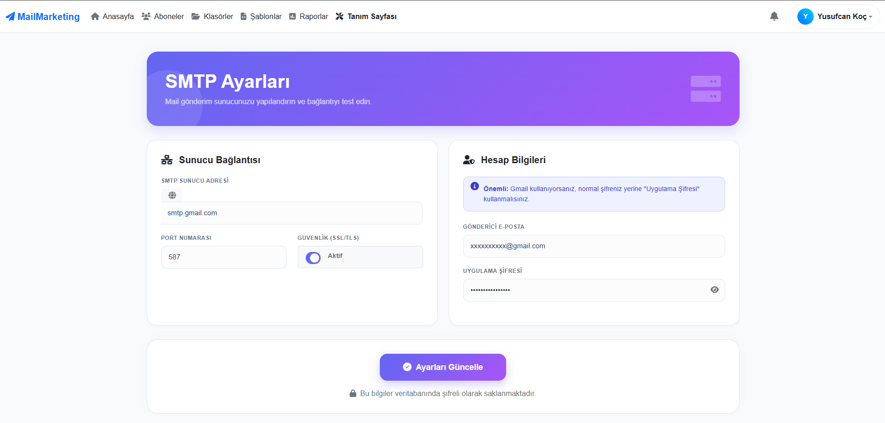 |
| **Detaylı Bounce & Aktivite Geçmişi** | **Sunucu ve SMTP Tanımlamaları** |

| Kullanıcı Profili | Aktivite Geçmişi |
| :---: | :---: |
| 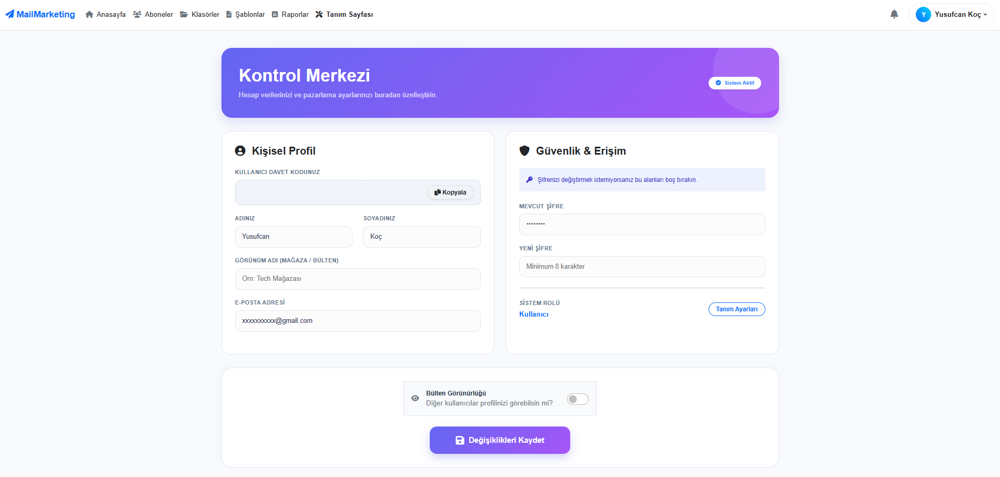 | 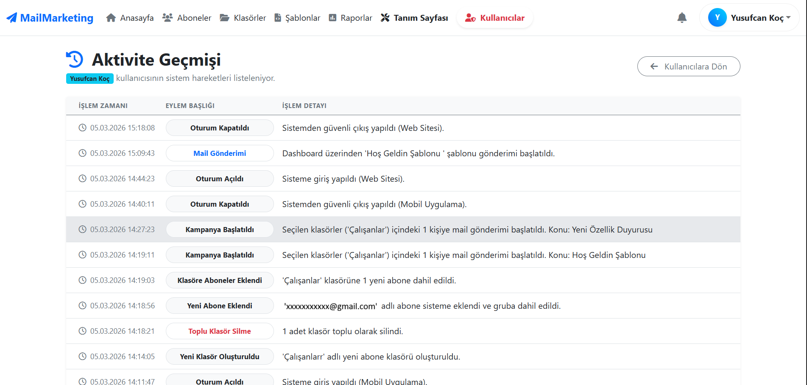 |
| **Gelişmiş Profil & Şifre Yönetimi** | **Kullanıcı İşlem Logları (Admin)** |

| Hazır Şablonlar | Bildirim Geçmişi |
| :---: | :---: |
| 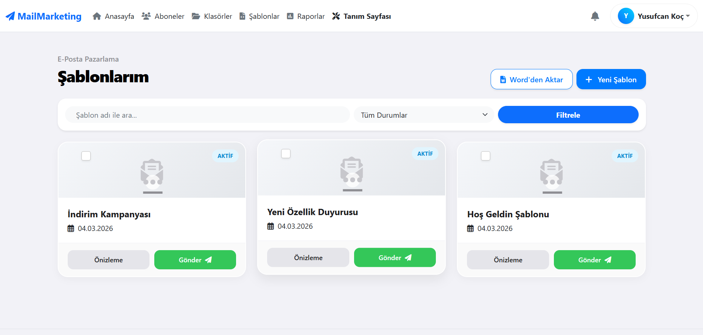 |  |
| **Özelleştirilebilir E-Posta Şablonları** | **Gerçek Zamanlı Sistem Bildirimleri** |

| Giriş & Kayıt Ekranları | Admin Paneli Kullanıcıları | Şifre Yenileme |
| :---: | :---: | :---: |
| 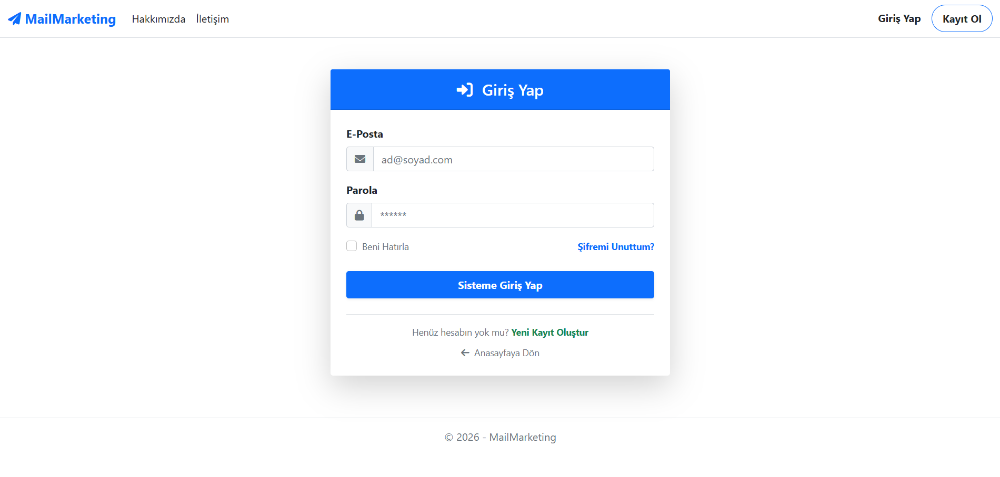 | 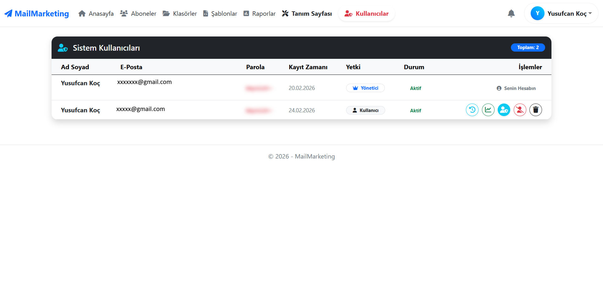 | 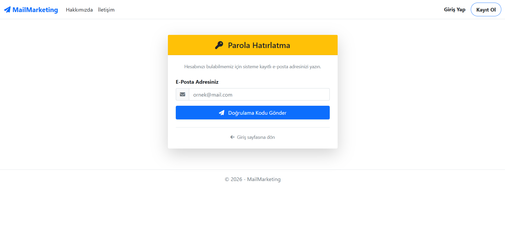 |

<br/>

*Aşağıdaki görseller uygulamanın React Native (Expo) ile geliştirilmiş mobil sürümünden alınmıştır.*

| Mobil Anasayfa & Navigasyon | Mobil Abone Yönetimi |
| :---: | :---: |
|  | 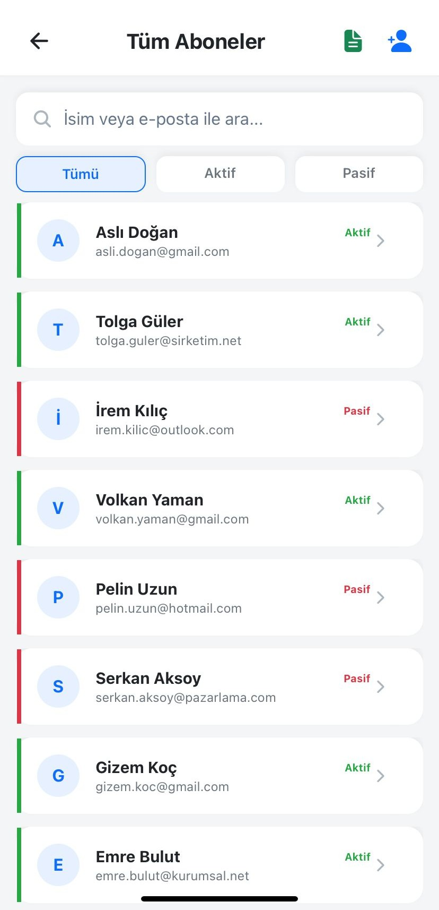 |
| **Tam Performanslı Dashboard** | **Native Swipe & Liste Deneyimi** |

| Mobil Yeni Gönderim (Kampanya) | Hazır Şablonlar |
| :---: | :---: |
|  | 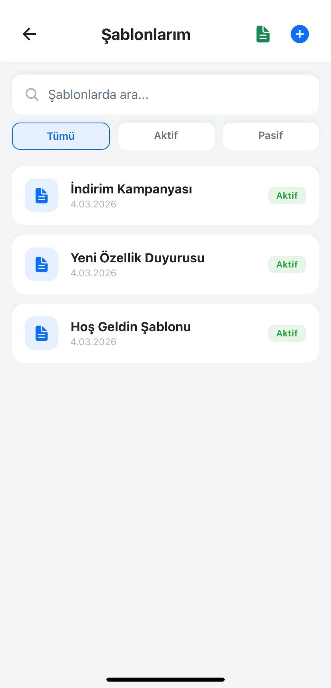 |
| **Mobil Arayüzden Hızlı Gönderim** | **Şablon Görüntüleme & Seçimi** |

| Raporlar & Analizler | Sistem Bildirimleri |
| :---: | :---: |
| 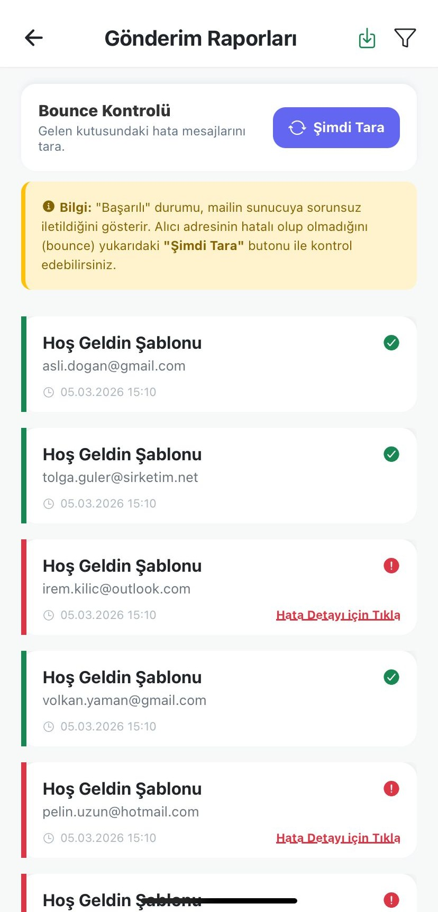 |  |
| **Detaylı Gönderim Analizleri** | **Uygulama İçi Bildirimler** |

| Kullanıcı Profili | Mobil Aktivite Günlüğü |
| :---: | :---: |
| 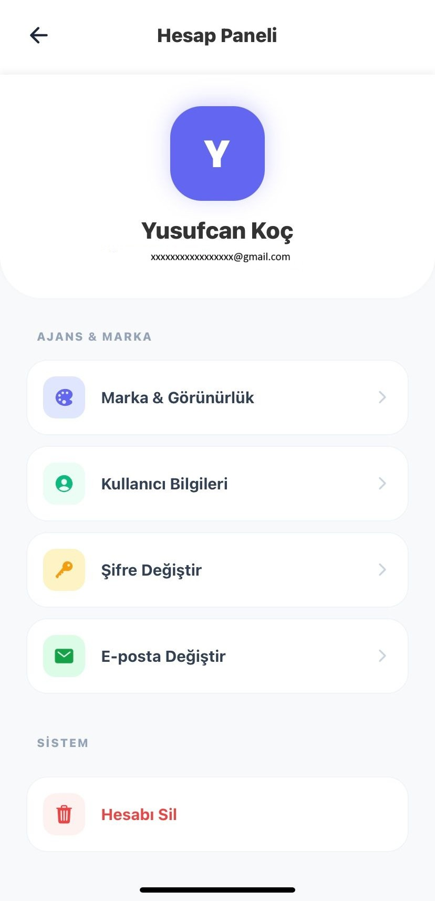 | 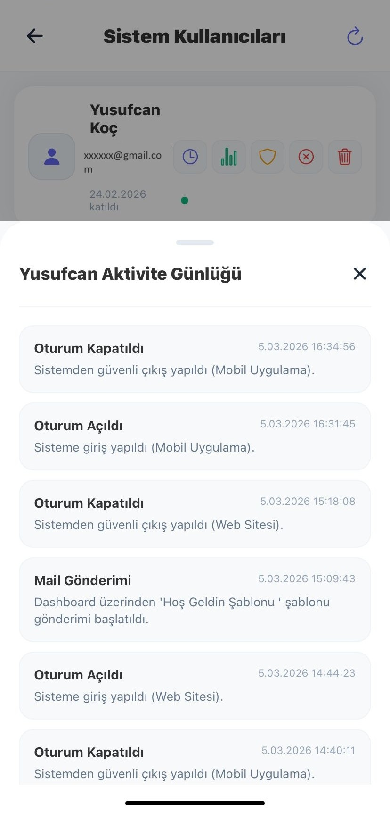 |
| **Detaylı Profil Yönetimi** | **Kullanıcı İşlem Geçmişi Takibi** |

| Güvenli Giriş Ekranı | Hızlı Kayıt & Parola Sıfırlama |
| :---: | :---: |
|  | 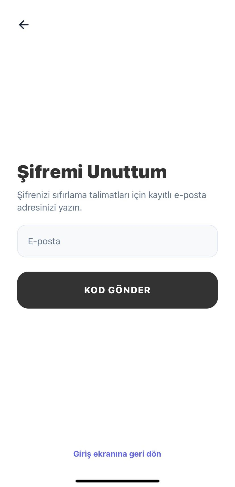 |
| **Modern ve Güvenli Tasarım** | **Akıcı Kullanıcı Deneyimi** |

<br/>
  
</p>

</div>

---

## 🎯 Proje Hakkında

Bu proje; işletmelerin, e-ticaret firmalarının ve dijital ajansların **abone listelerini**, **e-posta kampanyalarını** ve **gönderim raporlarını** tek bir platform üzerinden yönetmelerine imkân tanıyan, üretime hazır (production-ready) bir **Kurumsal E-Posta Pazarlama** çözümüdür.

> 💡 **Temel Fark:** Masaüstü ve web'e olan bağımlılığı tamamen ortadan kaldırmak amacıyla platform; mobil öncelikli (mobile-first) tasarımı, zengin web yönetim paneli ve güçlü bir REST API'siyle 3 katmanlı bir ekosistem olarak geliştirilmiştir.

---

## 🏛️ Sistem Mimarisi

```
┌─────────────────────────────────────────────────────────┐
│                     İSTEMCİLER (Clients)                │
│                                                         │
│  📱 React Native App    🌐 ASP.NET MVC WebUI            │
│     (iOS / Android)         (Yönetim Paneli)            │
└──────────────────────┬──────────────────────────────────┘
                       │  HTTP/S  (JWT Bearer Token)
                       ▼
┌─────────────────────────────────────────────────────────┐
│                MailMarketing.API (.NET 8)                │
│   Controllers · Middleware · Swagger · JWT Auth         │
├─────────────────────────────────────────────────────────┤
│              MailMarketing.Business                      │
│   MailService · BounceCheck · LogManager · Excel        │
├─────────────────────────────────────────────────────────┤
│           MailMarketing.DataAccess / Entity             │
│        Entity Framework Core · SQL Server               │
└─────────────────────────────────────────────────────────┘
```

---

## 🎁 Demo ve Örnek Kaynaklar

Projeyi hızlıca test edebilmeniz için kök dizindeki `/demo` klasörüne örnek dosyalar eklenmiştir:

- **📄 Word Şablonları:** `Hos_Geldin_Sablonu_V2.docx`, `Indirim_Kampanyasi_V2.docx` gibi dosyaları kullanarak sistemin **Word-to-HTML** dönüşümünü anında test edebilirsiniz.
- **📊 Excel Abone Listesi:** `OrnekAboneler.xlsx` dosyasını kullanarak toplu abone içe aktarma (Import) özelliğini deneyebilirsiniz.

---

## 🚀 Temel Özellikler

### 🔐 Kimlik Doğrulama & Güvenlik

| Özellik | Detay |
|---|---|
| JWT Bearer Token | Her API isteği imzalı token ile korunur |
| Rol Bazlı Yetkilendirme | Admin / Alt-Kullanıcı (Sub-admin) hiyerarşisi |
| Davet Kodu Sistemi | Alt kullanıcılar yalnızca geçerli davet koduyla kayıt olabilir |
| Şifre Hashleme | Brute-force saldırılarına dayanıklı ASP.NET PasswordHasher |
| 2 Aşamalı Şifre Sıfırlama | E-posta doğrulama kodu ile güvenli parola yenileme |
| Aktivite Loglama | Her oturum açma/kapama ve platform bilgisi (Web/Mobil) kayıt altına alınır |

### 📋 Abone (Subscriber) Yönetimi

| Özellik | Detay |
|---|---|
| Excel Import/Export | Binlerce aboneyi `.xlsx` dosyasıyla toplu içe/dışa aktarma (EPPlus v5) |
| Klasör / Grup Sistemi | Aboneleri özel klasörlerde (gruplarda) kategorize etme |
| Durum Takibi | Aktif / Pasif geçiş, toplu statü değiştirme |
| Bounce Yönetimi | Geri dönen (hatalı) mailleri otomatik algılayan `BounceCheckManager` |
| Audit Kısıtlaması | Gönderim geçmişi olan aboneler silinip raporlama bütünlüğü korunabilir |

### 📧 Kampanya & Şablonlar

| Özellik | Detay |
|---|---|
| HTML Şablon Editörü | Word belgelerini (docx) HTML e-posta şablonuna dönüştürme (Mammoth.js) |
| Paralel SMTP Gönderimi | 1.000+ aboneye bloke etmeyen, asenkron paralel mail motoru |
| ISP Engel Stratejisi | Akıllı delay ve toplu gönderim denetimiyle IP kara listeye girmeme |
| Kampanya Geçmişi | Her kampanyanın başarılı / başarısız gönderim sayıları |

### 📊 Raporlama & Analitik

| Özellik | Detay |
|---|---|
| Gerçek Zamanlı Dashboard | Haftalık analiz grafikleri, başarı/hata oranları |
| Filtrelenebilir Raporlar | Tarihe, duruma ve aboneye göre gelişmiş filtreleme |
| CSV Export | Tüm log geçmişini `.csv` olarak dışa aktarma |
| Admin Gözetimi | Bir adminin tüm alt kullanıcıların raporlarını tek panel üzerinden izlemesi |

---

## 🗂️ Proje Yapısı

```
MailMarketingProject/
│
├── MailMarketing.API/         # REST API (Sunum Katmanı)
│   └── Controllers/           # Auth, Subscribers, Reports, Campaign...
│
├── MailMarketing.Business/    # İş Kuralları Katmanı
│   ├── MailService.cs         # Paralel SMTP mail gönderim motoru
│   ├── BounceCheckManager.cs  # IMAP ile geri dönen mailleri tespit eder
│   └── LogManager.cs          # Aktivite loglarını yönetir
│
├── MailMarketing.DataAccess/  # EF Core DbContext ve Migration'lar
│
├── MailMarketing.Entity/      # POCO Entity sınıfları (User, MailLog, vb.)
│
├── MailMarketing.WebUI/       # ASP.NET Core MVC Yönetim Paneli
│
└── MailMarketingMobile/       # React Native (Expo) Mobil Uygulama
```

---

## 📱 Mobil Uygulama Ekranları

Mobil uygulama; performans odaklı `FlatList` sanallaştırması, native `Swipeable` kaydırma hareketleri, `react-native-reanimated` ile 60FPS akıcı animasyonlar ve glassmorphism tabanlı premium UI tasarımıyla geliştirilmiştir.

- 🏠 **Dashboard** — Gerçek zamanlı istatistikler, son kampanya özeti
- 👥 **Abone Yönetimi** — Kaydır-sil, uzun bas-çoklu seç, Excel içe aktarma
- 📂 **Klasörler** — Aboneleri gruplandır, klasör bazlı kampanya çıkar
- 🎨 **Şablonlar** — E-posta şablonu oluştur ve kampanyalara bağla
- 🚀 **Yeni Gönderim** — Şablon seç, hedef kitleyi belirle, kampanyayı başlat
- 📊 **Raporlar** — Filtrelenebilir gönderim geçmişi, hata/başarı analizi
- 👤 **Profil & SMTP** — Kişisel bilgiler, SMTP sunucu ayarları

---

## 🌐 Web Yönetim Paneli

ASP.NET Core MVC ile geliştirilen web paneli; büyük ekranlarda detaylı grafik analizi, toplu veri yönetimi ve kapsamlı admin araçları sunar.

- **Şablon Editörü** — HTML veya Word belgesi yükleyerek e-posta kalıbı oluşturma
- **Grafik Raporlar** — Chart.js ile haftalık/aylık trend analizi
- **Aktivite Günlüğü** — Tüm platform (Web / Mobil) işlem geçmişi

---

## ⚡ Kurulum

> Detaylı kurulum ve yapılandırma adımları için ilgili README dosyalarına bakınız.

| Bileşen | Rehber |
|---|---|
| 🔌 Backend API | [MailMarketing.API/README.md](./MailMarketing.API/README.md) |
| 📱 Mobil Uygulama | [MailMarketingMobile/README.md](./MailMarketingMobile/README.md) |

**Gereksinimler:** .NET 8 SDK · SQL Server · Node.js (v18+) · Expo CLI

---

## 🛠️ Teknoloji Yığını

| Katman | Teknolojiler |
|---|---|
| **Backend** | .NET 8, C#, ASP.NET Core, Entity Framework Core, MailKit, EPPlus |
| **Veritabanı** | Microsoft SQL Server, EF Core Code First Migrations |
| **Güvenlik** | JWT Bearer, ASP.NET Identity Hasher, Role-based Authorization |
| **Mobil** | React Native, Expo Router, Axios, Reanimated, Gesture Handler |
| **Web UI** | ASP.NET Core MVC, Razor Pages, Bootstrap, Chart.js, Mammoth.js |
| **Dokümantasyon** | Swagger / OpenAPI |

---

*© Bu proje, yüksek kod kalitesi (Clean Code, SOLID prensipleri) ve yazılım mühendisliği standartları gözetilerek geliştirilmiştir.*